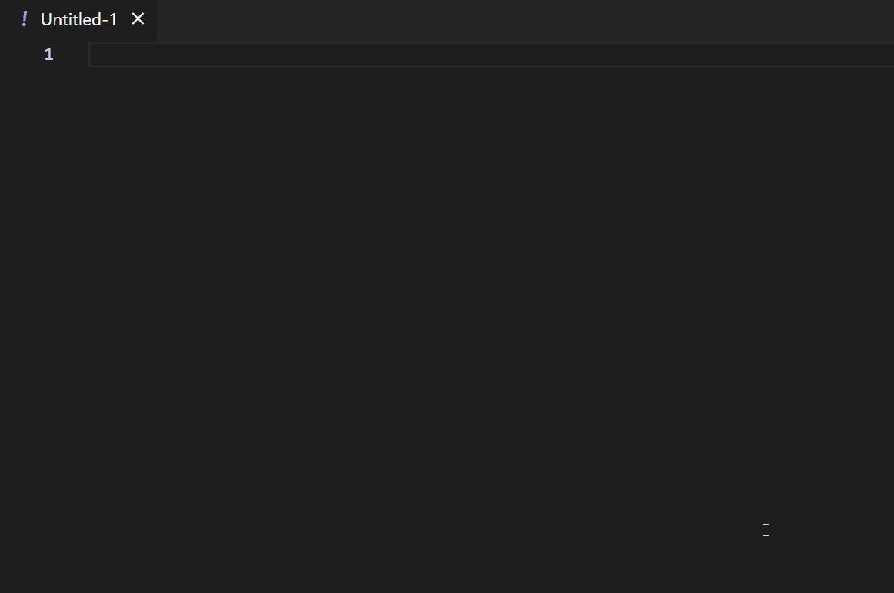

# Semgrep Snippets for VSCode

This extension for Visual Studio Code adds snippets for Semgrep for YAML.

## Usage

Type part of a snippet, press enter, and the snippet unfolds.

Alternatively, press Ctrl+Space (Windows, Linux) or Cmd+Space (macOS) to activate snippets from within the editor.

### Semgrep Snippets

| Snippet            | Description |
| :--- | - |
| `pattern:` | The pattern operator looks for code matching its expression. This can be basic expressions like $X == $X or unwanted function calls like hashlib.md5(...).|
| `- pattern:` | The pattern operator looks for code matching its expression. This can be basic expressions like $X == $X or unwanted function calls like hashlib.md5(...).|
| `patterns:` | The patterns operator performs a logical AND operation on one or more child patterns. This is useful for chaining multiple patterns together that all must be true. |
| `- patterns:` | The patterns operator performs a logical AND operation on one or more child patterns. This is useful for chaining multiple patterns together that all must be true. |
| `pattern-either:`             | The pattern-either operator performs a logical OR operation on one or more child patterns. This is useful for chaining multiple patterns together where any may be true. |
| `- pattern-either:` | The pattern-either operator performs a logical OR operation on one or more child patterns. This is useful for chaining multiple patterns together where any may be true. |
| `- pattern-regex:` | The pattern-regex operator searches files for substrings matching the given PCRE pattern. This is useful for migrating existing regular expression code search functionality to Semgrep. PCRE "Perl-Compatible Regular Expressions" is a full-featured regex library that is widely compatible with Perl of course, but also with the respective regex libraries of Python, JavaScript, Go, Ruby, and Java. |
| `- pattern-not-regex:` | The pattern-not-regex operator filters results using a Python re regular expression. This is most useful when combined with regular-expression only rules, providing an easy way to filter findings without having to use negative lookaheads. pattern-not-regex will work with regular pattern clauses, too. |
| `- metavariable-regex:` | The metavariable-regex operator searches metavariables for a Python re compatible expression. This is useful for filtering results based on a metavariable’s value. It requires the metavariable and regex keys and can be combined with other pattern operators. |
| `- metavariable-pattern:` | The metavariable-pattern operator matches metavariables with a pattern formula. This is useful for filtering results based on a metavariable’s value. It requires the metavariable key, and exactly one key of pattern, patterns, pattern-either, or pattern-regex. This operator can be nested as well as combined with other operators. |
| `- metavariable-comparison:` | The metavariable-comparison operator compares metavariables against a basic Python comparison expression. This is useful for filtering results based on a metavariable's numeric value. |
| `- pattern-not:` | The pattern-not operator is the opposite of the pattern operator. It finds code that does not match its expression. This is useful for eliminating common false positives. |

### Custom Boilerplate User Snippets

Ever wanted to build a starting template? Say now more, here are some to get you started:

| Snippet | Description |
| --- | --- |
| `!semgrep-pattern` | Create Semgrep Basic Pattern Boilerplate |
| `!semgrep-metavariable-pattern` | Create Semgrep Metavariable Pattern Boilerplate |
| `!semgrep-taint` | Create Semgrep Taint Boilerplate |
| `!semgrep-metavariable-comparison` | Create Semgrep Metavariable Pattern Boilerplate |
| `!semgrep-metavariable-comparison` | Advanced pattern-either Boilerplate |

## Installation

1. Install Visual Studio Code 1.10.0 or higher
1. Launch Code
1. From the command palette `Ctrl`-`Shift`-`P` (Windows, Linux) or `Cmd`-`Shift`-`P` (OSX)
1. Select `Install Extension`
1. Choose the extension
1. Reload Visual Studio Code

## Credits

Inspired from:
- [John Papa' Snippets](https://github.com/johnpapa/vscode-angular-snippets)